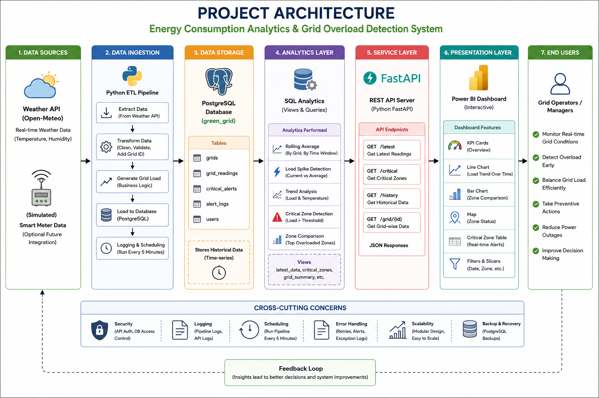
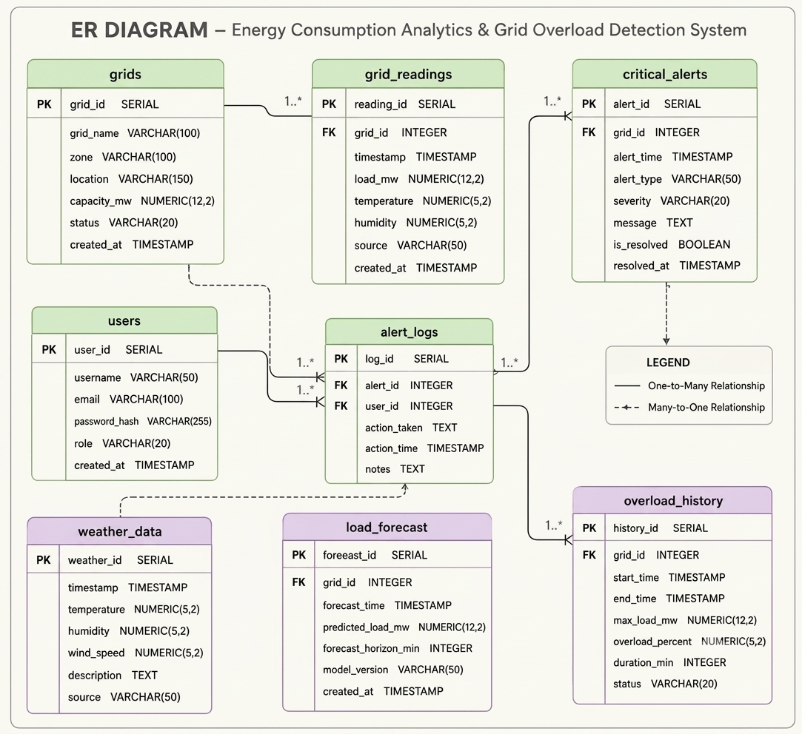

# ⚡ Energy Consumption Analytics & Grid Overload Detection System

A full end-to-end data engineering system that ingests live weather data, estimates electricity load per grid zone, stores and analyzes it in PostgreSQL, serves it through a REST API, and visualizes it on an interactive Power BI dashboard — built to help grid operators spot overload risk before it becomes a real problem.


---

## 📌 Table of Contents

1. [Project Purpose](#project-purpose)
2. [What This Project Actually Does](#what-this-project-actually-does)
3. [System Architecture](#system-architecture)
4. [Tech Stack](#tech-stack)
5. [Folder Structure](#folder-structure)
6. [Database Schema](#database-schema)
7. [Setup & Installation](#setup--installation)
8. [How to Run the Project](#how-to-run-the-project)
9. [API Reference](#api-reference)
10. [Dashboard](#dashboard)
11. [Screenshots](#screenshots)
12. [Logging & Error Handling](#logging--error-handling)
13. [Future Improvements](#future-improvements)
14. [Author](#author)

---

## 🎯 Project Purpose

Electricity grids fail silently until they don't — by the time a transformer overheats or a zone trips offline, the warning signs (rising load, high demand, extreme weather) were often visible minutes or hours earlier, just nobody was watching them systematically.

This project builds a small-scale, realistic version of the kind of monitoring system a utility company would actually run: continuously ingest environmental data, estimate load per zone, flag zones approaching their capacity limit, and put that information in front of a human who can act on it — before it becomes an outage.

It was built as an end-to-end portfolio project to demonstrate the full data engineering lifecycle: not just a script that processes a CSV once, but a live system with scheduled ingestion, a normalized database, an analytics layer, a REST API, and a BI dashboard — the same shape of system used in real energy, IoT, and infrastructure monitoring companies.

---

## 🧩 What This Project Actually Does

In plain terms, every 5 minutes, the system:

1. **Pulls live weather data** (temperature, humidity) for 5 grid zones from the free Open-Meteo API.
2. **Estimates an electricity load percentage** for each zone based on that weather — the model assumes cooling/heating demand rises as temperature moves away from a comfortable baseline (this is a stand-in for real smart-meter data, and the README is upfront about that).
3. **Stores every reading** in a PostgreSQL database, linked to its zone.
4. **Runs SQL analytics** — rolling averages, spike detection, and critical-zone flagging — using window functions and views.
5. **Serves that data over a REST API** with 4 endpoints, so any frontend (or Power BI) can consume it.
6. **Displays it on a live Power BI dashboard** with KPI cards, trend charts, and a critical-alerts table.

The end result: open the dashboard, and you can immediately see which zones are running hot, how load is trending over the day, and get an early signal before a zone crosses into genuinely critical territory.

---

## 🏗️ System Architecture

```
Open-Meteo Weather API
        │
        ▼
┌─────────────────────┐
│   Data Ingestion     │  Python ETL (extract → transform → load)
│   (data_pipeline/)    │  Runs every 5 minutes via APScheduler
└─────────┬────────────┘
          ▼
┌─────────────────────┐
│  PostgreSQL Database │  Normalized schema: grids, grid_readings,
│     (green_grid)      │  critical_alerts, users, alert_logs
└─────────┬────────────┘
          ▼
┌─────────────────────┐
│   Analytics Layer     │  Window functions, CTEs, views:
│    (analytics/)        │  rolling averages, overload detection
└─────────┬────────────┘
          ▼
┌─────────────────────┐
│   FastAPI REST API     │  /latest  /critical  /history  /grid/{id}
│        (api/)           │  Auto-generated Swagger docs
└─────────┬────────────┘
          ▼
┌─────────────────────┐
│   Power BI Dashboard   │  KPI cards, trend line, zone comparison,
│    (dashboard/)         │  scatter plot, critical alerts table
└─────────┬────────────┘
          ▼
    Grid Operators / Managers
   (monitor load, catch overload early, act before failure)
```

*(See `docs/architecture.png` for the full visual diagram.)*

---

## 🛠️ Tech Stack

| Layer | Technology | Why |
|---|---|---|
| Data Source | Open-Meteo API | Free, no API key required, reliable live weather data |
| ETL / Ingestion | Python 3.11, Requests, Pandas | Simple, readable, industry-standard for lightweight ETL |
| Scheduling | APScheduler | Cron-like recurring jobs without needing external infrastructure |
| Database | PostgreSQL | Relational integrity via foreign keys, strong window-function support |
| ORM / DB Access | SQLAlchemy + psycopg2 | Avoids raw string-built SQL (injection-safe), connection pooling |
| Analytics | Raw SQL — window functions, CTEs, views | Business logic lives close to the data, not duplicated in app code |
| Backend API | FastAPI + Uvicorn | Async-native, auto-generated docs, built-in Pydantic validation |
| Dashboard | Power BI Desktop | Industry-standard BI tool, connects directly to PostgreSQL |
| Config/Secrets | python-dotenv | Credentials never hardcoded, environment-scoped |
| Logging | Python `logging` (rotating file handler) | One consistent audit trail across the whole pipeline |

---

## 📁 Folder Structure

```
Energy-Consumption-Analytics-System/
├── data_pipeline/       # ETL: config, extract, transform, load, logger, scheduler
├── database/             # Schema creation, seed data, indexes
├── analytics/             # Window functions, overload detection, views
├── api/                    # FastAPI app, routes, schemas, DB connection
├── dashboard/               # Power BI file + documentation + design screenshot
├── docs/                      # Architecture/ER diagrams, screenshots
├── logs/                        # pipeline.log (runtime logs)
├── .env                           # Local credentials (NOT committed)
├── .gitignore
├── requirements.txt
├── run.py                          # Single entry point: starts scheduler + API together
└── README.md
```

---

## 🗄️ Database Schema

Five normalized tables, designed to avoid data duplication and keep each table responsible for one concern:

- **`grids`** — master list of grid zones (name, location, max capacity)
- **`grid_readings`** — every weather/load reading, linked to a grid (one-to-many)
- **`critical_alerts`** — fired when a reading crosses the overload threshold, linked to the grid and the specific reading that triggered it
- **`users`** — operators/managers who can act on alerts
- **`alert_logs`** — audit trail of who acknowledged/resolved which alert

*(See `docs/er_diagram.png` for the full entity-relationship diagram.)*

---

## ⚙️ Setup & Installation

### Prerequisites
- Python 3.11+
- PostgreSQL installed locally (or accessible remotely)
- Power BI Desktop (for the dashboard)

### 1. Clone the repository
```bash
git clone <your-repo-url>
cd Energy-Consumption-Analytics-System
```

### 2. Set up the Python environment
```bash
python -m venv venv
venv\Scripts\activate        # Windows
source venv/bin/activate     # macOS/Linux

pip install -r requirements.txt
```

### 3. Configure environment variables
Copy `.env` and fill in your real PostgreSQL credentials:
```
DB_HOST=localhost
DB_PORT=5432
DB_NAME=green_grid
DB_USER=your_db_username
DB_PASSWORD=your_db_password
```

### 4. Set up the database
Run these files against PostgreSQL, in order (via pgAdmin's Query Tool or `psql`):
```
database/create_tables.sql
database/insert_master_data.sql
database/indexes.sql
```

### 5. Run the analytics layer
Run these, in order (views first — later files depend on them):
```
analytics/latest_data_view.sql
analytics/critical_zone_view.sql
analytics/window_functions.sql
analytics/overload_detection.sql
analytics/trend_analysis.sql
analytics/dashboard_queries.sql
```

---

## ▶️ How to Run the Project

**Option A — one command, runs everything together (recommended for a full demo):**
```bash
python run.py
```
This starts the ETL scheduler (background thread, runs every 5 minutes) and the FastAPI server together.

**Option B — run each piece separately (useful while developing):**
```bash
# ETL pipeline once, manually
python -m data_pipeline.main

# ETL on a recurring 5-minute schedule
python -m data_pipeline.scheduler

# API server with hot-reload for active development
uvicorn api.app:app --reload
```

Then open:
- API docs: `http://127.0.0.1:8000/docs`
- Power BI: open `dashboard/GridSense.pbix`, click **Refresh** to pull the latest data

---

## 🔌 API Reference

| Method | Endpoint | Description |
|---|---|---|
| GET | `/` | Health check |
| GET | `/latest` | Current snapshot of every zone |
| GET | `/critical` | Zones currently at 80%+ load, ranked by severity |
| GET | `/history?grid_id=&limit=` | Historical readings, optionally filtered by zone |
| GET | `/grid/{grid_id}` | Full detail for one zone + its most recent reading |

Full interactive documentation auto-generated at `/docs` (Swagger UI).

---

## 📊 Dashboard

The Power BI dashboard (`dashboard/GridSense.pbix`) includes:
- 4 KPI cards: total grids, average load, highest temperature, critical zone count
- Line chart: load trend over time, split by zone
- Bar chart: average load comparison across zones
- Scatter plot: temperature vs. load correlation
- Table: currently critical zones
- Slicers: filter by zone and date range

See `dashboard/dashboard_documentation.md` for details on how each visual is built.

---

## 🖼️ Screenshots


| Screenshot | Description |
|---|---|
|  | System architecture diagram |
|  | Database entity-relationship diagram |
|  | Full Power BI dashboard view |
|  | FastAPI Swagger UI in action |

---

## 📝 Logging & Error Handling

Every pipeline run is logged to `logs/pipeline.log` with timestamps and severity levels. The system handles failures at three layers:
- **Per-record / per-zone**: a single bad reading or API failure for one zone doesn't stop the others
- **Retry with backoff**: transient failures (flaky API calls, DB connection drops) automatically retry up to 3 times
- **Scheduler-level safety net**: any unexpected error is logged rather than silently killing future scheduled runs

---

## 🚀 Future Improvements

- Replace the synthetic load model with real smart-meter data (if hardware becomes available)
- Add authentication to the API (JWT-based, using the existing `users` table)
- Deploy the API and scheduler as a Docker container / cloud service instead of running locally
- Add email/SMS alerting when a zone crosses into CRITICAL severity
- Expand from 5 zones to city-wide coverage

---

## 👤 Author

- Manisha Banerjee

Final-year B.Tech student — built as a hands-on portfolio project to practice the full data engineering lifecycle: ETL, database design, SQL analytics, REST API development, and BI dashboarding.

